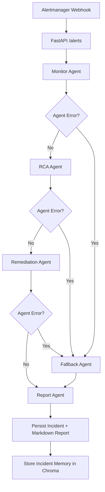

# 🤖 AIOps Agentic Self-Healing Kubernetes Platform

An AI-driven AIOps platform that monitors Kubernetes workloads, analyzes operational signals, and automatically performs remediation actions using Agentic AI workflows.

The system integrates observability tools, Kubernetes automation, and LLM-based reasoning to create a self-healing infrastructure environment.

## 🚀 Overview

Modern cloud infrastructure produces large volumes of metrics, logs, and alerts.
Operational issues often require manual investigation and remediation.

This project builds an automated incident response system that:

- Monitors cluster health using observability tools
- Detects anomalies through alerting rules
- Uses AI to analyze metrics and logs
- Determines the most appropriate remediation action
- Supports remediation execution through API-driven actions
- Produces structured RCA output for visibility and auditability

## 🏗 Architecture

```text
                 GitHub
                   │
                   ▼
                 Jenkins
                   │
                   ▼
                Docker Build
                   │
                   ▼
            Kubernetes (Minikube)
              ┌─────────┴─────────┐
              │                   │
              ▼                   ▼
            Sample App          AI Engine
              │                       │
       ┌──────────┼──────────┐        │
       │          │          │        ▼
       ▼          ▼          ▼   Alertmanager
    Prometheus    Loki      Grafana      │
       │                        ▲        ▼
       └────────────────────────┴────────┘
              Observability Signals
                   │
                   ▼
          LangGraph Multi-Agent Workflow
                   │
                   ▼
              Analyze Alert Context
                   │
                   ▼
                Collect Metrics
                   │
                   ▼
            Precheck + Smart Routing
              ┌─────────┴─────────┐
              │                   │
              ▼                   ▼
          Fast Path Decision   Logs/LLM Path
          (skip optional)        (optional)
              └─────────┬─────────┘
                        ▼
              Guardrailed Decision
                        │
                        ▼
              Remediation API Action
```

## 🧭 Agent Workflow

The AI engine executes a multi-agent orchestration path with guarded handoffs and fallback behavior.



### Additional Improvements Implemented

- Added multi-agent traceability with per-agent status and detail events in incident records.
- Added persistent incident artifacts: JSONL history plus Markdown report generation.
- Added RAG similarity retrieval and write-back using Chroma persistent storage.
- Added RAG diagnostics endpoint: `GET /diagnostics/rag`.
- Added guarded auto-remediation modes with confidence thresholds, cooldown, and retry windows.
- Added persistent image-pull rollback safety checks with retry-threshold gating.
- Added HPA-aware scaling that can raise `maxReplicas` within configured caps.
- Added memory remediation that patches deployment memory limits and restarts workload safely.
- Added generalized target-container selection with selection reasoning in remediation responses.
- Added broader Kubernetes alert coverage and routing for crashloop/image-pull/config/readiness classes.

## 🛠 Tech Stack

### DevOps

- GitHub
- Docker
- Kubernetes (Minikube)
- Helm
- Jenkins

### Observability

- Prometheus
- Grafana
- Alertmanager
- Loki
- Promtail

### AI / Agentic AI

- LangGraph
- LangChain
- Ollama
- RAG (Retrieval-Augmented Generation)
- ChromaDB

### Application Layer

- Python
- FastAPI
- Streamlit

### Platform Integration

- Kubernetes Python Client

## 📂 Project Structure

```text
aiops-agentic-platform/
├── .gitignore
├── README.md
├── ai-engine/
│   ├── Dockerfile
│   ├── agents/
│   │   ├── __init__.py
│   │   ├── monitor_agent.py
│   │   ├── rca_agent.py
│   │   ├── remediation_agent.py
│   │   ├── report_agent.py
│   │   └── state.py
│   ├── api/
│   │   └── main.py
│   ├── requirements.txt
│   ├── tools/
│   │   ├── llm_client.py
│   │   ├── loki_client.py
│   │   ├── notification.py
│   │   ├── prometheus_client.py
│   │   └── rag/
│   │       ├── __init__.py
│   │       ├── base.py
│   │       ├── chroma_store.py
│   │       └── service.py
│   └── workflows/
│       ├── agent_workflow.py
│       └── cpu_workflow.py
├── app/
│   ├── Dockerfile
│   ├── requirements.txt
│   └── src/
│       └── app.py
├── dashboard/
│   ├── Dockerfile
│   ├── app.py
│   └── requirements.txt
├── docs/
│   └── architecture.md
├── grafana/
│   └── dashboards/
│       └── stress-app-dashboard.json
├── jenkins/
│   └── Jenkinsfile
├── k8s/
│   ├── ai-engine-deployment.yaml
│   ├── ai-engine-incidents-pvc.yaml
│   ├── ai-engine-rbac.yaml
│   ├── ai-engine-service.yaml
│   ├── alertmanager/
│   │   └── alertmanager.yaml
│   ├── alerts/
│   │   ├── cpu-alert.yaml
│   │   └── loki-alerts.yaml
│   ├── discord-webhook-secret.yaml
│   ├── dashboard-deployment.yaml
│   ├── dashboard-ingress.yaml
│   ├── dashboard-service.yaml
│   ├── grafana-dashboard.yaml
│   ├── loki/
│   │   ├── loki-values.yaml
│   │   └── promtail-values.yaml
│   ├── stress-app-deployment.yaml
│   ├── stress-app-hpa.yaml
│   └── stress-app-service.yaml
└── (scripts/ and venv/ excluded)
```

## 📊 Operations Dashboard

The Streamlit dashboard provides live operational visibility from AI engine APIs.

Source files:

- `dashboard/app.py`
- `dashboard/requirements.txt`
- `dashboard/Dockerfile`

Dashboard views include:

- Recent incidents with RCA recommendation and decision source
- Active incident count in a configurable time window
- Remediation history and outcome distribution (executed/skipped/failed)
- RAG diagnostics (`collection_count`, latest retrieval metadata)

### Run Dashboard

```bash
cd dashboard
pip install -r requirements.txt
streamlit run app.py
```

By default the dashboard points to `http://localhost:18000`.
You can change API base URL from the sidebar.

### Kubernetes Deployment (No Local Streamlit Run)

Dashboard Kubernetes manifests:

- `k8s/dashboard-deployment.yaml`
- `k8s/dashboard-service.yaml`
- `k8s/dashboard-ingress.yaml` (optional)

Build and push dashboard image:

```bash
docker build -t bacdocker/aiops-dashboard:latest ./dashboard
docker push bacdocker/aiops-dashboard:latest
```

Deploy manifests:

```bash
kubectl apply -f k8s/dashboard-service.yaml
kubectl apply -f k8s/dashboard-deployment.yaml
kubectl apply -f k8s/dashboard-ingress.yaml
kubectl rollout status deployment/aiops-dashboard -n default --timeout=300s
```

Access dashboard without local Streamlit process:

Option A: Service URL (quick local access)

```bash
minikube -p aiops service aiops-dashboard -n default --url
```

Option B: Ingress hostname (stable URL)

```bash
minikube -p aiops addons enable ingress
minikube -p aiops tunnel
```

Add host mapping in `/etc/hosts`:

```text
127.0.0.1 aiops-dashboard.local
```

Then open:

```text
http://aiops-dashboard.local
```

When using Docker driver on macOS, keep the `minikube tunnel` terminal running.

In-cluster dashboard uses:

- `AIOPS_API_BASE_URL=http://ai-engine.default.svc.cluster.local:8000`

## 🔁 Jenkins CI/CD Integration

The CI/CD pipeline is implemented in:

- `jenkins/Jenkinsfile`

Pipeline stages:

- Checkout
- Quality gates (Python compile checks + Kubernetes manifest dry-run)
- Docker build (`ai-engine` + `aiops-dashboard`)
- Test execution (auto-detect test presence)
- Docker push (build tag + latest for both images)
- Kubernetes deploy + rollout status validation (both deployments)
- Smoke checks + API contract checks (engine + dashboard)

### Quality Gates Included

- Python compilation for `ai-engine`, `app`, and `dashboard`
- Kubernetes manifest validation with `kubectl apply --dry-run=client`
- Post-deploy smoke and contract validation for:
  - `/`
  - `/incidents`
  - `/incidents/remediations`
  - Dashboard web UI response (`aiops-dashboard` service)

### Jenkins Credentials

Expected credential:

- `dockerhub-pass` (secret text)

Optional environment variable:

- `DOCKERHUB_USERNAME` (defaults to `bacdocker` if not set)

### Secrets Management (Recommended)

Do not commit real webhook URLs to Git (including base64 values). Keep placeholder YAML in repository and inject real secrets at runtime.

Local/dev setup command (idempotent):

```bash
kubectl -n default create secret generic ai-engine-discord-webhook \
  --from-literal=webhook-url='YOUR_REAL_WEBHOOK_URL' \
  --dry-run=client -o yaml | kubectl apply -f -
kubectl rollout restart deployment/ai-engine -n default
```

Verify currently configured value:

```bash
kubectl get secret ai-engine-discord-webhook -n default -o jsonpath='{.data.webhook-url}' | base64 -d; echo
```

Keep webhook secret provisioning outside Jenkins for a cleaner pipeline:

- Create/update `ai-engine-discord-webhook` with `kubectl` before deploy
- Keep `k8s/discord-webhook-secret.yaml` as placeholder-only template in git

## 🧪 Stress Test Application

A lightweight microservice used to simulate common production failures.
It generates CPU spikes, memory pressure, and application errors that will later be detected by the observability stack and analyzed by the AI engine.

### Endpoints

| Endpoint | Description |
|----------|-------------|
| /health | Application health check |
| /stats | Returns active stress simulation stats |
| /cpu-stress | Simulates CPU load (supports workers and iterations) |
| /memory-leak | Simulates memory growth (supports batches, chunk size, sleep) |
| /reset-memory | Clears simulated memory allocations |
| /error | Generates application error logs |
| /crash | Force exits process to simulate CrashLoopBackOff |

### Run Locally

```bash
cd app/src
python app.py
```

The service will run on:

```
http://localhost:5001
```

### Example

Trigger CPU stress:

```bash
curl "http://localhost:5001/cpu-stress?workers=2&iterations=80000000"
```

Trigger memory stress:

```bash
curl "http://localhost:5001/memory-leak?batches=50&chunk_size=200000&sleep_ms=200"
```

View internal stress counters:

```bash
curl http://localhost:5001/stats
```

System resource usage can be observed using:

```bash
top
```

This service will later be deployed in Kubernetes to generate test scenarios for the AIOps platform.

## 📦 Containerization

The stress test application is packaged as a Docker container for portability and deployment in Kubernetes.

### Build Image

```bash
docker build -t bacdocker/aiops-stress-app:v2 ./app
```

### Run Container

```bash
docker run -p 5001:5001 bacdocker/aiops-stress-app:v2
```

### Push to Docker Hub

```bash
docker push bacdocker/aiops-stress-app:v2
```

The container image will be used later when deploying the application to Kubernetes.

## ☸️ Kubernetes Deployment

The stress test application is deployed to a local Kubernetes cluster using Minikube.
The container image pushed to Docker Hub is used to create a Kubernetes Deployment and exposed using a NodePort Service.

### Deployment Steps

#### 1) Start Minikube Cluster

Start the cluster using the dedicated profile created for the project.

```bash
minikube start -p aiops --driver=docker --cpus=4 --memory=6144
```

Verify cluster status:

```bash
kubectl get nodes
```

Expected output:

```text
NAME    STATUS   ROLES           AGE   VERSION
aiops   Ready    control-plane
```

#### 2) Enable Required Minikube Addons

Certain Kubernetes features require additional components.

Enable metrics collection and ingress support:

```bash
minikube addons enable metrics-server -p aiops
minikube addons enable ingress -p aiops
```

Verify metrics-server pod:

```bash
kubectl get pods -n kube-system
```

Expected:

```text
metrics-server-xxxx   1/1   Running
```

Metrics server is required for:

```bash
kubectl top pods
kubectl top nodes
```

#### 3) Create Kubernetes Deployment

Deployment file:

`k8s/stress-app-deployment.yaml`

Apply the deployment:

```bash
kubectl apply -f k8s/stress-app-deployment.yaml
```

Verify deployment:

```bash
kubectl get deployments
kubectl get pods
```

Example output:

```text
stress-app-69f4d9c755-mgks2   1/1   Running
```

#### 4) Expose Application with Service

Service file:

`k8s/stress-app-service.yaml`

Apply the service:

```bash
kubectl apply -f k8s/stress-app-service.yaml
```

Verify service:

```bash
kubectl get svc
```

Example output:

```text
stress-app-service   NodePort   5001:30007/TCP
```

### Accessing the Application

Because Minikube runs inside Docker on macOS, direct NodePort access may not always work.
Minikube provides a helper command that creates a temporary tunnel.

Run:

```bash
minikube service stress-app-service -p aiops
```

Example output:

```text
http://127.0.0.1:53002
```

The terminal must remain open while the tunnel is active.

### Manual Application Testing

The application endpoints were tested using curl.

#### Health Check

```bash
curl http://127.0.0.1:<PORT>/health
```

Expected response:

```json
{"status":"healthy"}
```

#### CPU Stress Simulation

```bash
curl "http://127.0.0.1:<PORT>/cpu-stress?workers=2&iterations=80000000"
```

This triggers high CPU usage inside the pod.

#### Memory Stress Simulation

```bash
curl "http://127.0.0.1:<PORT>/memory-leak?batches=50&chunk_size=200000&sleep_ms=200"
```

This increases memory consumption inside the container.

#### Crash Simulation (for restart/CrashLoop testing)

```bash
curl http://127.0.0.1:<PORT>/crash
```

#### View Runtime Stats

```bash
curl http://127.0.0.1:<PORT>/stats
```

### Monitoring Pod Resource Usage

After enabling metrics-server:

```bash
kubectl top pods
```

Example output:

```text
NAME                          CPU(cores)   MEMORY(bytes)
stress-app-69f4d9c755-mgks2   1003m        205Mi
```

This confirms that the stress simulation generates observable resource usage in Kubernetes.

### Issues Encountered

#### Minikube Context Issue

In local setups with multiple clusters/profiles, `kubectl` may point to the wrong context.

Typical symptoms:

- `kubectl get pods` shows unexpected resources
- `kubectl top pods` fails unexpectedly
- service URLs or port-forward targets do not match deployed workloads

Verify current context:

```bash
kubectl config current-context
```

Switch to the project context:

```bash
kubectl config use-context aiops
```

Confirm cluster and profile health:

```bash
kubectl get nodes
minikube profile list
minikube status -p aiops
```

If the profile is stopped, start it:

```bash
minikube start -p aiops --driver=docker --cpus=4 --memory=6144
```

Ensure metrics addon is enabled:

```bash
minikube addons enable metrics-server -p aiops
```

Verify metrics-server pod:

```bash
kubectl get pods -n kube-system | grep metrics-server
```

Then re-check workloads:

```bash
kubectl get pods
kubectl get pods -n monitoring
```

### Result

The stress testing application is running inside the Kubernetes cluster and generating measurable CPU and memory load.

## ⚙️ Environment Setup

### Prerequisites

Install required tools:

- Docker Desktop
- Minikube
- kubectl
- Helm
- Python 3.11+
- Ollama

MacOS installation example:

```bash
brew install minikube kubectl helm ollama
```

## ☸️ Kubernetes Cluster

The platform runs on a local Kubernetes cluster using Minikube.

Start the cluster:

```bash
minikube start -p aiops --driver=docker --cpus=4 --memory=6144
```

Verify cluster:

```bash
kubectl get nodes
```

## 📈 Kubernetes Monitoring Setup with Prometheus and Grafana

### Objective

Set up a monitoring stack in Kubernetes to collect and visualize metrics from cluster workloads.
This setup enables observing resource usage such as CPU and memory from running pods and prepares the platform for alerting and AIOps analysis.

### Monitoring Stack Architecture

The monitoring stack consists of:

- **Prometheus** - collects and stores metrics from Kubernetes
- **Grafana** - visualizes metrics through dashboards
- **Node Exporter** - collects node-level metrics
- **kube-state-metrics** - exposes Kubernetes object metrics
- **Metrics Server** - provides resource metrics for pods and nodes

```text
        Kubernetes Cluster
               │
               ▼
   Prometheus (Metrics Collection)
               │
               ▼
      Grafana (Visualization)
               │
               ▼
 Dashboards (CPU, memory, pod status)
```

### Installing Prometheus Stack

The monitoring stack is installed using **Helm**, the standard package manager for Kubernetes.

#### Add Helm Repository

```bash
helm repo add prometheus-community https://prometheus-community.github.io/helm-charts
helm repo update
```

#### Install kube-prometheus-stack

```bash
helm install monitoring prometheus-community/kube-prometheus-stack \
  --namespace monitoring \
  --create-namespace
```

This installs:

- Prometheus
- Grafana
- Alertmanager
- Node Exporter
- kube-state-metrics

### Verifying Installation

Check the deployed resources.

#### Verify Pods

```bash
kubectl get pods -n monitoring
```

Example output:

```text
monitoring-grafana
monitoring-kube-prometheus-operator
monitoring-kube-state-metrics
monitoring-prometheus-node-exporter
```

#### Verify Services

```bash
kubectl get svc -n monitoring
```

### Accessing Grafana

Forward the Grafana service to the local machine:

```bash
kubectl port-forward svc/monitoring-grafana 3000:80 -n monitoring
```

Open Grafana in the browser:

```text
http://localhost:3000
```

#### Default Credentials

```text
username: admin
password: for password run "kubectl --namespace monitoring get secrets monitoring-grafana -o jsonpath="{.data.admin-password}" | base64 -d ; echo"
```

### Verifying Metrics Collection

Prometheus automatically scrapes metrics from:

- Kubernetes nodes
- Running pods
- kube-state-metrics
- Node exporter

To confirm metrics are available:

```bash
kubectl top pods
```

Example output:

```text
NAME                          CPU(cores)   MEMORY(bytes)
stress-app-xxxxx              1000m        200Mi
```

This confirms that resource metrics are being collected.

### Visualizing Pod CPU Usage

A stress testing application was deployed earlier to simulate high CPU utilization.

When the stress endpoint is triggered:

```text
/cpu-stress
```

the application increases CPU consumption.

Prometheus collects these metrics and Grafana dashboards display the usage over time.

Example CPU query used in dashboards:

```promql
sum(rate(container_cpu_usage_seconds_total{namespace="default"}[5m])) by (pod)
```

This query calculates CPU usage for each pod over time.

### Dashboard Visualization

Grafana dashboards visualize:

- Pod CPU usage
- Pod memory consumption
- Node CPU utilization
- Node memory usage
- Pod restart count
- Pod status

These dashboards help monitor workload behavior and detect anomalies.

### Testing Monitoring with Stress Application

Trigger CPU load in the application:

```bash
curl "http://<service-url>/cpu-stress?workers=2&iterations=80000000"
```

Observe the metrics in Grafana dashboards where CPU utilization increases for the corresponding pod.

This confirms that the monitoring stack is correctly collecting and visualizing metrics.

### Outcome

The Kubernetes cluster is now equipped with a complete monitoring stack capable of:

- Collecting real-time metrics from nodes and pods
- Visualizing resource usage through Grafana dashboards
- Monitoring application behavior under load

This monitoring foundation enables alerting and automated response capabilities.

## 🚨 Alerting System Setup and Verification

### Objective

Kubernetes alerting is configured using Prometheus alert rules and Alertmanager to detect abnormal pod CPU usage.
The target condition is pod CPU usage above 80%, validating end-to-end anomaly detection.

### Alerting Flow

```text
         Application Pod
               │
               ▼
    Prometheus Collects Metrics
               │
               ▼
   Prometheus Evaluates Rules
               │
               ▼
    Alertmanager Receives Alert
               │
               ▼
     Alert Visible in UI
```

### Custom Alert Rule

Alert rule file:

`k8s/alerts/cpu-alert.yaml`

Key rule behavior:

- Alert name: `HighPodCPUUsage`
- Expression monitors pod CPU rate in `default` namespace
- Threshold: `> 0.8` (80% CPU)
- Duration: `for: 10s`
- Severity: `warning`

Example expression:

```promql
sum by (pod) (rate(container_cpu_usage_seconds_total{namespace="default"}[2m])) > 0.8
```

### Deploy and Verify Rule

Apply rule:

```bash
kubectl apply -f k8s/alerts/cpu-alert.yaml
```

Verify rule object:

```bash
kubectl get prometheusrules -n monitoring
```

Expected to include:

```text
aiops-alert-rules
```

### Prometheus Verification

Port-forward Prometheus:

```bash
kubectl port-forward svc/monitoring-kube-prometheus-prometheus 9090 -n monitoring
```

UI:

```text
http://localhost:9090
```

Check rule in:

```text
Status → Rule Health
```

### Trigger and Validate Alert

Generate CPU stress:

```bash
curl "http://<service-ip>/cpu-stress?workers=2&iterations=80000000"
```

Validate resource usage:

```bash
kubectl top pods
kubectl top nodes
```

When CPU remains above threshold, alert status becomes:

```text
FIRING
```

Alert details:

- Alert: `HighPodCPUUsage`
- Pod: `stress-app`
- Severity: `warning`
- Typical observed value: `~1.0 CPU`

### Alertmanager Verification

Port-forward Alertmanager:

```bash
kubectl port-forward svc/monitoring-kube-prometheus-alertmanager 9093 -n monitoring
```

UI:

```text
http://localhost:9093
```

Active alert contains:

```text
summary: High CPU usage detected
description: Pod CPU usage above 80%
status: FIRING
```

### Result

Validated end-to-end alerting pipeline:

- Prometheus metrics collection
- Alert rule evaluation
- Alert firing
- Alertmanager reception
- Alert visibility in UI

This confirms the platform can automatically detect infrastructure anomalies.

## 🤖 AI Engine Integration with Alertmanager

### Objective

Integrate the AI engine with the observability stack so alerts generated by Prometheus are automatically delivered through Alertmanager webhooks.

This enables the platform to move from passive monitoring to AI-driven incident analysis. When an alert is triggered, the AI engine receives the payload, pulls live metrics from Prometheus (CPU, memory, restart rate, OOMKilled), and starts the automated investigation workflow.

### Architecture Flow

```text
          Alertmanager Webhook
                 │
                 ▼
          AI Engine (/alerts)
                 │
                 ▼
         Dynamic LangGraph Flow
                 │
                 ▼
             Analyze Alert
                 │
                 ▼
            Collect Metrics
                 │
                 ▼
           Pre-decision Check
            ┌─────┴─────┐
            │           │
            ▼           ▼
       Fast Path   Smart Routing
        (direct)        │
                        ▼
                 Collect Logs?
                  ┌─────┴─────┐
                  │           │
                  ▼           ▼
               Yes: logs    No: skip
                  │           │
                  └─────┬─────┘
                        ▼
               LLM RCA (optional)
                        │
                        ▼
           Guardrailed Remediation Decision
```

### AI Engine Microservice

The AI engine is implemented as a FastAPI microservice responsible for receiving alerts and initiating investigation workflows.

Main responsibilities:

- Receive alerts from Alertmanager
- Parse alert payload
- Trigger LangGraph workflow
- Perform incident analysis
- Decide remediation actions

### AI Engine API

The AI engine exposes webhook endpoints used by Alertmanager.

#### Health Check Endpoint

`GET /`

Response:

```json
{
  "status": "AI Engine running"
}
```

#### Alert Webhook Endpoint

`POST /alerts`

This endpoint receives alert payloads from Alertmanager.

Example payload:

```json
{
  "alerts": [
    {
      "labels": {
     "alertname": "HighPodCPUUsage",
     "pod": "stress-app"
      }
    }
  ]
}
```

The AI engine extracts alert information and triggers the workflow.

#### Analyze Endpoint

`POST /analyze`

- Accepts alert payload
- Executes AI workflow
- Returns structured RCA response

Example response:

```json
{
     "analysis": {
          "alert_name": "HighPodCPUUsage",
          "pod": "stress-app-xxxx",
          "root_cause": "High CPU saturation",
          "recommendation": "scale deployment",
          "confidence": 0.95,
          "observed_metrics": {
               "cpu_usage": 0.92,
               "memory_usage_bytes": 214000000,
               "restart_count_5m": 0,
               "oomkilled": 0
          }
     }
}
```

#### Remediation Endpoint

`POST /remediate`

- Accepts remediation decision input
- Executes remediation with Kubernetes safety guardrails

Supported actions:

- `restart pod`
- `scale deployment`
- `increase memory limit and restart pod` (patches deployment memory limit, then restarts workload)
- `rollback deployment` (supported with rollout-history and image-pull safety checks)

Example response:

```json
{
     "status": "executed",
     "action": "scale deployment"
}
```

Dry-run example response:

```json
{
  "status": "dry-run",
  "action": "restart pod",
  "namespace": "default",
  "pod": "stress-app-xxxx"
}
```

#### Incident Query Endpoints

`GET /incidents?limit=20`

- Returns recent persisted incidents with lifecycle fields and report artifact path

`GET /incidents/{incident_id}`

- Returns a single incident record by ID

`GET /incidents/remediations?limit=50`

- Returns recent remediation attempt history across incidents

`GET /diagnostics/rag`

- Returns active RAG backend, collection count, and latest retrieval-hit diagnostics

### Incident Report and History Store

Every processed firing alert now generates a persistent report artifact:

- JSON history row (`incidents.jsonl`) with lifecycle, decision, and remediation attempts
- Markdown report (`reports/<incident_id>.md`) with human-readable incident summary

Stored fields include:

- `incident_id`
- `correlation_id`
- `source`
- timestamps (`created_at`, `completed_at`)
- decision and analysis payload
- remediation attempt history (action, mode, reason, outcome)

In Kubernetes, incident history is stored on a mounted PVC through:

- `k8s/ai-engine-incidents-pvc.yaml`
- `k8s/ai-engine-deployment.yaml` (`INCIDENT_STORE_DIR=/data/incidents`)

### RAG Memory Foundation

Retrieval-Augmented Generation (RAG) improves RCA consistency using prior incident memory.

Implementation modules:

- Adapter interface: `ai-engine/tools/rag/base.py`
- Active backend: `ai-engine/tools/rag/chroma_store.py`
- Backend resolver/facade: `ai-engine/tools/rag/service.py`

RAG flow:

```text
Alert + Metrics + Logs
    │
    ▼
   Build Similarity Query
    │
    ▼
 Retrieve Top-K Incidents
    │
    ▼
 Augment RCA Prompt Context
    │
    ▼
  LLM JSON Generation
    │
    ▼
 Guardrails + Policy Check
    │
    ▼
 Persist Incident + Memory
```

#### Retrieval (R)

Retrieval runs inside workflow RCA before the LLM call.

How retrieval is implemented:

- A similarity query is built from current alert context:
  - `alert_name`
  - `pod`
  - observed metrics (`cpu_usage`, `memory_usage_bytes`, `restart_count_5m`, `oomkilled`)
  - recent log snippets
- The query is sent to incident memory store as top-k search (`limit=3`).
- Returned items contain:
  - metadata (`incident_id`, `alert_name`, `namespace`, `pod`, `recommendation`, `root_cause`)
  - stored incident document text
  - similarity distance

Code path:

- Workflow retrieval call: `ai-engine/workflows/cpu_workflow.py`
- Backend search implementation: `ai-engine/tools/rag/chroma_store.py`

#### Augmentation (A)

Augmentation injects retrieved incident summaries into the RCA prompt context.

How augmentation is implemented:

- Retrieved incidents are normalized into compact context lines.
- Context is inserted in prompt section:
  - `Similar incidents from memory (for context, do not copy blindly)`
- Prompt instruction enforces safe usage:
  - use similar incidents only as weak prior context
  - rely on current metrics/logs as primary evidence

This keeps RAG helpful without blindly repeating previous actions.

#### Generation (G)

Generation remains LLM RCA, but now conditioned on both current signals and retrieved context.

How generation is implemented:

- LLM produces JSON output (`root_cause`, `recommendation`, `confidence`).
- Existing guardrails/policy still apply after generation:
  - recommendation normalization
  - alert-specific safety checks
  - confidence checks
  - auto-remediation policy gating

RAG does not bypass safety controls; it improves context quality before decisioning.

#### Memory Write-back

Write-back persists each processed incident to vector memory after incident persistence.

Write-back triggers:

- `POST /alerts` flow
- `POST /remediate` flow

Each stored memory document includes incident identity, alert context, root cause, recommendation, confidence, and observed metrics.

#### Runtime Configuration

Runtime controls for backend selection:

- `INCIDENT_MEMORY_BACKEND=chroma`
- `INCIDENT_MEMORY_PATH=/data/incidents/chroma`
- `INCIDENT_MEMORY_COLLECTION=incident_memory` (optional)

Default deployment persists vector memory under the existing incident PVC mount (`/data/incidents/chroma`).

### Alert Processing Logic

When an alert is received:

- Alert payload is parsed
- Alert labels are extracted
- LangGraph workflow is invoked
- Investigation process begins

Example processing flow:

```text
        Received Alert Payload
                 │
                 ▼
          Extract Alert Name
                 │
                 ▼
            Extract Pod Name
                 │
                 ▼
        Invoke LangGraph Workflow
```

### LangGraph Multi-Agent Workflow

The AI engine uses LangGraph to orchestrate specialized agents for monitoring, RCA, remediation, and reporting.

Workflow stages:

```text
             Alert Received
                   │
                   ▼
     Monitor Agent
                   │
                   ▼
    RCA Agent (Precheck +
  Routing + Optional LLM/RAG)
                   │
                   ▼
  Remediation Agent (Policy +
  Kubernetes Execution/Dry-Run)
       │
       ▼
      Report Agent
       │
       ▼
  Incident Report + Memory Write-back
```

Prometheus client used by workflow:

- File: `ai-engine/tools/prometheus_client.py`
- API endpoint: `http://monitoring-kube-prometheus-prometheus.monitoring:9090/api/v1/query`
- CPU query pattern: `sum(rate(container_cpu_usage_seconds_total{pod="<pod-name>"}[2m]))`
- Memory query pattern: `sum(container_memory_working_set_bytes{namespace="default",pod="<pod-name>"})`
- Restart query pattern (5m): `sum(increase(kube_pod_container_status_restarts_total{namespace="default",pod="<pod-name>"}[5m]))`
- OOMKilled query pattern: `max(kube_pod_container_status_last_terminated_reason{namespace="default",pod="<pod-name>",reason="OOMKilled"})`

Loki client used by workflow:

- File: `ai-engine/tools/loki_client.py`
- API endpoint: `http://loki.monitoring.svc.cluster.local:3100/loki/api/v1/query_range`
- Log selector pattern: `{pod="<pod-name>"}` (fallback `{kubernetes_pod_name="<pod-name>"}`)
- Query type: range query (required for log stream queries)

LLM client used by workflow:

- File: `ai-engine/tools/llm_client.py`
- Endpoint: `http://host.docker.internal:11434/api/generate`
- Model behavior: code default is `llama3.2:latest`, and runtime model can be overridden through `OLLAMA_MODEL` (deployment currently uses `llama3.1:8b`)
- Output handling: JSON extraction with deterministic rule-based fallback if parsing fails
- Network validation: connectivity from AI engine pod to Ollama endpoint was validated from inside pod (`http://host.docker.internal:11434`)

Alert-aware decision mapping in workflow:

- `HighPodCPUUsage` uses CPU thresholds for scale/monitor/no-action
- `HighMemoryUsage` uses memory working set for restart/monitor/investigate
- `PodCrashLoop` uses restart_count_5m for restart investigation logic
- `PodOOMKilled` uses OOMKilled signal for memory-limit/remediation recommendation

This modular flow allows expansion in later stages.

### Containerizing the AI Engine

The AI engine is packaged as a Docker container for Kubernetes deployment.

Build image:

```bash
docker build -t bacdocker/ai-engine:v31 ./ai-engine
```

Push image:

```bash
docker push bacdocker/ai-engine:v31
```

### Deploying AI Engine to Kubernetes

Deployment manifest:

`k8s/ai-engine-deployment.yaml`

Service manifest:

`k8s/ai-engine-service.yaml`

Service DNS:

`ai-engine.default.svc.cluster.local`

### Alertmanager Webhook Configuration

Alertmanager sends alerts to AI engine using webhook receiver.

Configuration file:

`k8s/alertmanager/alertmanager.yaml`

Example webhook config:

```yaml
receivers:
- name: ai-engine
  webhook_configs:
  - url: http://ai-engine.default.svc.cluster.local:8000/alerts
    send_resolved: true
```

Routing rule:

```yaml
routes:
- matchers:
  - alertname =~ "HighPodCPUUsage|HighMemoryUsage|PodCrashLoop|PodCrashLoopBackOff|PodOOMKilled|PodImagePullBackOff|PodErrImagePull|PodImagePullBackOffPersistent|PodCreateContainerConfigError|PodNotReadyTooLong"
  receiver: ai-engine
```

### Prometheus Alert Rules

Prometheus now evaluates multiple operational risk conditions from a single rules file: `k8s/alerts/cpu-alert.yaml`.

Configured alerts:

- `HighPodCPUUsage`
- `HighMemoryUsage`
- `PodCrashLoop`
- `PodCrashLoopBackOff`
- `PodOOMKilled`
- `PodImagePullBackOff`
- `PodErrImagePull`
- `PodImagePullBackOffPersistent`
- `PodCreateContainerConfigError`
- `PodNotReadyTooLong`

Example CPU expression:

```promql
sum(rate(container_cpu_usage_seconds_total{namespace="default"}[2m])) by (namespace, pod) > 0.8
```

### Testing the Integration

Test flow:

- Start the stress application
- Trigger CPU load
- Wait for Prometheus detection
- Alertmanager sends webhook
- AI engine receives alert

Example trigger:

```bash
curl "http://<stress-app-service>/cpu-stress?workers=2&iterations=80000000"
```

### Verifying AI Engine Execution

Monitor AI engine logs:

```bash
kubectl logs -l app=ai-engine -f
```

Expected output:

```text
Received Alert Payload
Analyzing alert: HighPodCPUUsage
Fetching Prometheus metrics for pod: <pod>
[METRICS] Pod=<pod> CPU=<value> MEM=<value> RESTARTS_5M=<value> OOMKILLED=<value>
Running pre-decision checks
Routing after metrics
Fetching logs from Loki for pod: <pod>
[LOGS] Retrieved <n> log lines
Running LLM-based RCA
[LLM RESPONSE] {"root_cause":"...","recommendation":"...","confidence":0.9}
Deciding remediation action
[LOG_ANALYSIS] Sample logs: ["...", "...", "..."]
[DECISION_INPUT] alert=<alert_name> pod=<pod> cpu=<value> memory_bytes=<value> restarts_5m=<value> oomkilled=<value>
[DECISION] recommendation=<action> source=<llm|rules-fallback|guardrail-override>
[PROVENANCE] decision_source=<value> recommended_by=<llm|guardrail|rules> guardrail_notes=<text>
```

Low-signal fast-path output may skip logs/LLM and return a direct recommendation.

### Result

The system now supports automatic alert delivery from Alertmanager to AI engine, evolving the platform from monitoring-only to AI-assisted incident investigation.

Alerts generated in Kubernetes can now automatically initiate AI-based workflows.

### Workflow Intelligence and Guardrail Summary

The current implementation combines multi-agent orchestration, LLM/RAG RCA, and production safety controls.

Implemented changes:

- Added LangGraph multi-agent chain: monitor, rca, remediate, report, and fallback.
- Added agent-level trace capture for auditability and easier debugging.
- Added dynamic precheck/routing to skip expensive steps on low-signal alerts.
- Added LLM RCA with deterministic guardrails and rule-based fallback.
- Added decision provenance fields: `decision_source`, `recommended_by`, and `guardrail_notes`.
- Added explainability through `reasoning_trace` payloads.
- Added robust JSON extraction and normalization for LLM outputs.
- Added Kubernetes remediation execution via guarded action allowlists and namespace allowlists.
- Added auto-remediation modes for `/alerts`: `off`, `dry-run`, and `safe-auto`.
- Added confidence policy gates, cooldown windows, and retry limits to reduce flapping.
- Added persistent image-pull rollback gating using retry-threshold checks and revision-history validation.
- Added HPA-aware scaling with bounded automatic max-replica adjustments.
- Added memory remediation flow: memory-limit patch plus pod restart/rollout restart fallback.
- Added generalized target-container scoring with sidecar-aware heuristics.
- Added container selection audit metadata in remediation responses.
- Added adapter-based RAG with Chroma backend, retrieval augmentation, and memory write-back.
- Added RAG diagnostics endpoint for runtime verification.
- Updated and validated deployment using latest AI engine image: `bacdocker/ai-engine:v31`.

### Auto-Remediation Policy Modes

`AUTO_REMEDIATION_MODE` controls automatic execution behavior for alerts received on `POST /alerts`:

- `off`: recommendation-only mode, no auto execution
- `dry-run`: policy and action path execute, but Kubernetes mutations are not applied
- `safe-auto`: executes only policy-approved actions after confidence, cooldown, and retry checks

If `AUTO_REMEDIATION_MODE` is missing or invalid, the service falls back to legacy `AUTO_REMEDIATE` compatibility.

Operational validation performed:

- Kubernetes rollout completed successfully for AI engine
- In-pod connectivity check to Ollama host endpoint passed (`Ollama is running`)

## 🔁 One-Command Reproducible Setup

To keep the project fully declarative and repeatable, use the scripts in `scripts/`.

### Bootstrap (install/reconcile everything)

From project root:

```bash
./scripts/bootstrap.sh --start-minikube --profile=aiops
```

If Minikube is already running, you can run:

```bash
./scripts/bootstrap.sh --profile=aiops
```

What it does:

- Starts Minikube profile (optional via `--start-minikube`)
- Installs/updates Helm releases (`monitoring`, `loki`, `promtail`)
- Applies app manifests (`stress-app`, `ai-engine`)
- Applies alert rules (`cpu-alert`, `loki-alerts`)
- Reconciles Alertmanager config from `k8s/alertmanager/alertmanager.yaml`

### Reset (clean installed resources)

```bash
./scripts/reset.sh --profile=aiops
```

This removes Helm releases and applied manifests so the environment can be recreated cleanly.

Recommended full recreate sequence:

```bash
./scripts/reset.sh --profile=aiops
./scripts/bootstrap.sh --start-minikube --profile=aiops
```

## 🗂️ Complete Setup Guide (Loki, Alerting, AI Engine)

This section provides standard installation and configuration steps so a new user can set up logging, alerting, and AI-driven alert handling from scratch.

### 1) Loki + Promtail Installation (Helm)

Loki stores logs and Promtail collects logs from Kubernetes nodes/pods and ships them to Loki.

#### Files Used

- `k8s/loki/loki-values.yaml`
- `k8s/loki/promtail-values.yaml`

#### Install Steps

Add Grafana Helm repo:

```bash
helm repo add grafana https://grafana.github.io/helm-charts
helm repo update
```

Install Loki in `monitoring` namespace:

```bash
helm upgrade --install loki grafana/loki \
  -n monitoring \
  -f k8s/loki/loki-values.yaml
```

Install Promtail in `monitoring` namespace:

```bash
helm upgrade --install promtail grafana/promtail \
  -n monitoring \
  -f k8s/loki/promtail-values.yaml
```

#### Verify Installation

```bash
kubectl get pods -n monitoring | egrep 'loki|promtail'
kubectl get svc -n monitoring | grep loki
```

Optional: access Promtail debug endpoints locally using port-forward:

```bash
kubectl port-forward -n monitoring daemonset/promtail 3101:3101
```

Then open:

```text
http://localhost:3101/targets
http://localhost:3101/metrics
```

Optional: verify logs in Grafana Explore (Datasource: Loki).

### 2) Prometheus Alert Rules Setup

Apply alert rules file:

```bash
kubectl apply -f k8s/alerts/cpu-alert.yaml
```

Verify rules:

```bash
kubectl get prometheusrules -n monitoring
```

Configured alerts include:

- `HighPodCPUUsage`
- `HighMemoryUsage`
- `PodCrashLoop`
- `PodOOMKilled`

Optional Loki safety alert file:

```bash
kubectl apply -f k8s/alerts/loki-alerts.yaml
```

### 3) Alertmanager Webhook Configuration

Alertmanager forwards selected alerts to the AI engine webhook endpoint.

Configuration file:

- `k8s/alertmanager/alertmanager.yaml`

Apply configuration:

```bash
kubectl create secret generic alertmanager-monitoring-kube-prometheus-alertmanager \
  --from-file=alertmanager.yaml=k8s/alertmanager/alertmanager.yaml \
  -n monitoring \
  --dry-run=client -o yaml | kubectl apply -f -

kubectl rollout restart statefulset alertmanager-monitoring-kube-prometheus-alertmanager -n monitoring
```

Required webhook endpoint:

- `http://ai-engine.default.svc.cluster.local:8000/alerts`

### Discord Notifications

When an alert is processed by `POST /alerts`, AI engine now posts a summary message to Discord.

Files involved:

- `ai-engine/tools/notification.py`
- `ai-engine/api/main.py`
- `k8s/ai-engine-deployment.yaml`
- `k8s/discord-webhook-secret.yaml`

Configure webhook securely through Kubernetes Secret (recommended):

```bash
kubectl create secret generic ai-engine-discord-webhook \
  --from-literal=webhook-url='<YOUR_DISCORD_WEBHOOK_URL>' \
  -n default \
  --dry-run=client -o yaml | kubectl apply -f -
```

Or edit the template file and apply:

```bash
kubectl apply -f k8s/discord-webhook-secret.yaml
```

Deploy/restart AI engine:

```bash
kubectl apply -f k8s/ai-engine-deployment.yaml
kubectl rollout restart deployment/ai-engine -n default
kubectl rollout status deployment/ai-engine -n default --timeout=300s
```

Notification behavior:

- Controlled by `DISCORD_NOTIFICATIONS_ENABLED` (default `true`)
- Uses `DISCORD_WEBHOOK_URL` from secret `ai-engine-discord-webhook`
- Sends incident summary (alert, pod, namespace, root cause, recommendation, confidence, remediation outcome)

Routing pattern for AIOps alerts:

- `alertname =~ "HighPodCPUUsage|HighMemoryUsage|PodCrashLoop|PodOOMKilled"`

### 4) AI Engine Build and Deployment

Build and push AI engine container image:

```bash
docker build -t bacdocker/ai-engine:v31 ./ai-engine
docker push bacdocker/ai-engine:v31
```

Deploy AI engine manifests:

```bash
kubectl apply -f k8s/ai-engine-deployment.yaml
kubectl apply -f k8s/ai-engine-service.yaml
kubectl rollout status deployment/ai-engine -n default
```

Verify running image:

```bash
kubectl get pods -n default -l app=ai-engine -o jsonpath='{.items[0].spec.containers[0].image}' && echo
```

### 5) End-to-End Validation

1. Trigger stress endpoint:

```bash
curl "http://<stress-app-service>/cpu-stress?workers=2&iterations=80000000"
```

2. Check alerts in Prometheus/Alertmanager.
3. Check AI engine logs:

```bash
kubectl logs -n default -l app=ai-engine -f
```

### Expected Platform Flow

```text
               Stress App Issue
                       │
                       ▼
           Prometheus Rule Fires
                       │
                       ▼
          Alertmanager Routes Alert
                       │
                       ▼
             Webhook to AI Engine
                       │
                       ▼
            FastAPI Receives Alert
                       │
                       ▼
       LangGraph Runs (dynamic routing)
                       │
                       ▼
       Remediation Decision (guardrailed)
```

## 🧠 AI Engine Concept

The AI engine performs automated incident analysis and remediation.

Core workflow:

```text
               Alert Received
                      │
                      ▼
                Collect Metrics
                      │
                      ▼
      Pre-decision Check + Smart Routing
                      │
                      ▼
           Collect Logs (optional)
                      │
                      ▼
        LLM Root Cause Analysis (optional)
                      │
                      ▼
             Remediation Decision
                      │
                      ▼
      Remediation API Execution (guardrailed execution mode)
```

Supported remediation recommendations:

- Restart Pod
- Scale Deployment
- Increase memory limit and restart pod
- Investigate and restart pod
- Monitor / No action / Investigate

## 📊 Observability Stack

The observability layer collects operational data from the Kubernetes cluster.

- Metrics: Prometheus
- Visualization: Grafana
- Alerts: Alertmanager
- Logs: Loki + Promtail

## 📦 Development Environment

Create Python environment:

```bash
python3 -m venv venv
source venv/bin/activate
```

Install dependencies:

```bash
pip install fastapi langchain langgraph chromadb kubernetes streamlit
```

## 🔐 Security Notes

- Avoid committing secrets or API keys.
- Use `.env` files for sensitive configuration.
- Ensure `.env` and local virtual environments are ignored in `.gitignore`.

Example:

```gitignore
.env
venv
__pycache__
```
