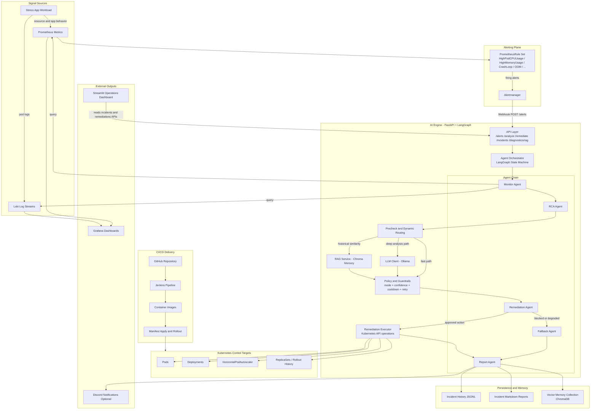

# AIOps Platform Architecture

This document captures the implemented architecture and runtime control flow of the AIOps Agentic Self-Healing Kubernetes Platform.

## 1) End-to-End Architecture Flow

## 2) Control Logic Highlights

### Agent Orchestration

- Runtime chain: monitor -> rca -> remediate -> report
- On agent error, execution routes through fallback path and still emits report artifacts

### Decision and Safety Model

- Recommendation source is hybrid: rules + LLM + RAG context
- Guardrails enforce:
  - action allowlist
  - namespace allowlist
  - auto-remediation mode (off, dry-run, safe-auto)
  - confidence thresholds by alert class
  - cooldown window and retry limits
- Additional protections:
  - HPA-aware scaling constraints
  - image-pull rollback threshold gating

### Persistence and Explainability

- Every processed incident stores:
  - incident record (JSONL)
  - markdown report artifact
  - remediation attempt history
  - agent trace timeline
- Incident memory is written to Chroma for future similarity retrieval

## 3) Operational Interfaces

### Ingress Interfaces

- Alertmanager webhook -> POST /alerts
- Manual RCA -> POST /analyze
- Manual remediation -> POST /remediate

### Query Interfaces

- GET /incidents
- GET /incidents/{incident_id}
- GET /incidents/remediations
- GET /diagnostics/rag

### Notification Interface

- Discord webhook via optional secret-backed configuration

## 4) Source Traceability

- API execution core: ai-engine/api/main.py
- Orchestration graph: ai-engine/workflows/agent_workflow.py
- RCA routing and guardrails: ai-engine/workflows/cpu_workflow.py
- Remediation policy and Kubernetes actions: ai-engine/api/main.py
- Notification adapter: ai-engine/tools/notification.py
- Alert routes: k8s/alertmanager/alertmanager.yaml
- Alert rules: k8s/alerts/cpu-alert.yaml
